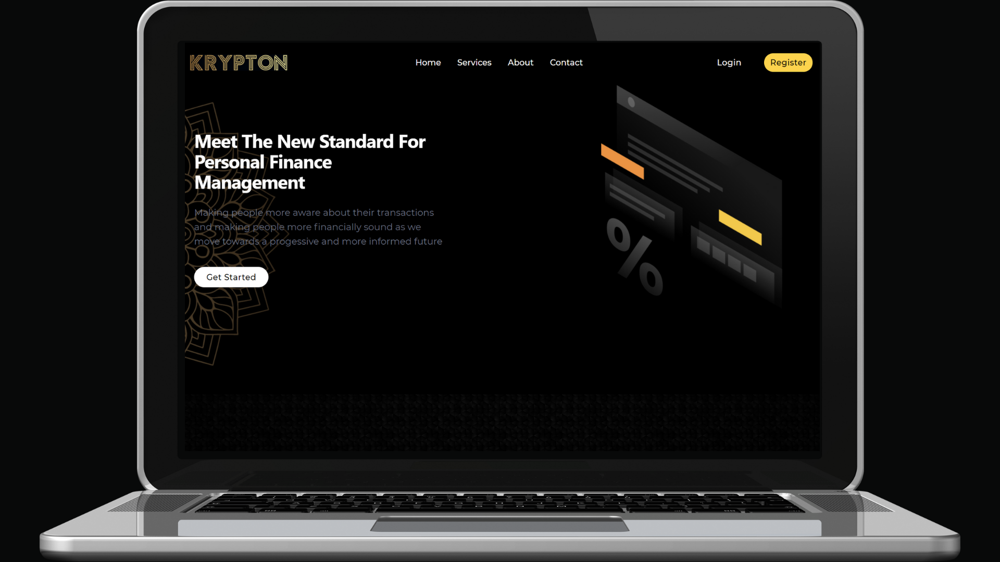

<!-- PROJECT LOGO -->
<h1 align="center"> KRYPTON </h1>

An online money management system with the aim of making individuals more aware about their expenditures and also to show recent financial news with a stock of choice to overview on the glance. These are elaborated in the upcoming sections. <br>
Aimed to cater young individuals the mission is to make financial literacy, an important part in everyone's life a common place so that they are financially aware.

<br/>

<p align="center">
    
  <p align="center">
    <a href="https://krypton1.netlify.app/">View Demo</a>
    ·
    <a href="https://github.com/Narottam04/Krypton/issues">Report Bug</a>
    ·
    <a href="https://github.com/Narottam04/Krypton/issues">Request Feature</a>
  </p>
</p>


<!-- TABLE OF CONTENTS -->
<details open="open">
  <summary>Table of Contents</summary>
  <ol>
    <li><a href="#inspiration">Inspiration</a></li>
    <li><a href="#about-the-project">About the project</a></li>
    <li><a href="#technologies-used">Technologies used</a></li>
    <li><a href="#how-we-built-it">How we built it</a></li>
    <li><a href="#challenges-we-ran-into">Challenges we ran into</a></li>
    <li><a href="#guide-to-setup-the-project-locally">Guide to setup the project locally</a></li>
    <li><a href="#acknowledgements-and-references">Acknowledgements and References</a></li>
  </ol>
</details>


## Inspiration
Obtaining financial literacy is one of the most important things an individual can do to ensure prolonged financial stability. 
Strong financial knowledge and decision-making skills help people weigh options and make informed choices for their financial situations, such as deciding how and when to save and spend, comparing costs before a big purchase, and planning for retirement or other long-term savings. 

While investing in stock markets has become more popular in recent times, overall penetration remains low — only 2.78 crore Indians invest in the stock markets, which is around 2% of the country’s population. In comparison, over 50% of Americans own stocks. This is a mind set that can be changes if people are exposed to topics like investments and stocks which is a great financial practice. 

This is where Krypton comes in, to build a habit for being accountable for the income and expenses.

Krypton provides a watch-list for stocks and also provides relevent financial news and insights so that they have a mind set of using money wisely.

## About the project

<p align="center">
  
<p align="center">
    
Krypton is an online money management system with the aim of making individuals aware about their expediture and make them financially sound by providing them with stock watchlists and news that is relevent to investing and financial advices. The following are the key-words used in our project:

### Personal Finance Management
Having personal finances in-check is necessary and hence the there is a personal finance tracker which helps the user to keep a tab of their transactions, which is the first step towards financial growth and literacy.
      
### Stock Overview
Having the overview of the best performing stocks is a good practice as it improves the reasoning of why the stocks are moving the way they are and also understanding the sentiment of the market.
      
### Financial News
News plays a very important role in how people invest and why people invest.Financial news is the key to understanding the stock market sentiment and also making the users aware about the different changes and reforms happening globally.
    
### Investment Radar
Showing an Investment Radar to keep a check on the trending stocks and to keep a tab on the recent changes is the best way to start on the investment path and this is provided on the dashboard as well as a dedicated stock insight tab.    

### Financial Knowledge
Having personal finances in-check is necessary and hence the there is a personal finance tracker which helps the user to keep a tab of their transactions, which is the first step towards financial growth and literacy.    


A list of all the references and resources we used to achieve (partially) our goal are listed in the acknowledgements.
## Technologies used
    
<p align="center" float="left">
      
<a href="https://www.react.org/"></a>
<a href="https://www.netlify.com/"></a>
<a href="https://firebase.google.com/"></a>
<a href="https://www.postman.com/product/api-repository/"></a>
<a href="https://www.alphavantage.co/"></a>                                                                                                 
</p>

    
React.js as the base library along with tailwind css<br/>
Firebase for the authentication of the users so that every users information can be saved<br/>
Netlify to host the react app <br/>
Postman Api for financial news <br/>
AlphaVantage for Stocks overview <br/>


## How we built it

First we came up with a problem statement and started to design and prototype the basic functionality of the web app on Adobe Xd.

Then we followed with building a basic prototype of all the features that can be included. 

Then went with designing and developing UI using ReactJs & Tailwind CSS (with help of few resources mentioned in the last section). 


## Challenges we ran into

The frontend developers were not familiar with tailwind CSS. So it took a while to build frontend and to polish it out.

This is our first time to integrate firebase authentication and different api's with a web application.

We intially thought of making a flutter app but were not able to proceed due to lack of resources.

Responsiveness was an issue which was solved. 

## What's next for Krypton

Due to the time constraint of the hackathon, many things were accomplished only till half way. These include :

- Unique Digital Cards: We are planning to build a feature where every user will be able to access a digital card that features all their acheivements
 based on their current and previous investments.

- Goal Tracker: To add a roadmap so that, user can set a goal and track their progress of different investment.

- More Investment Option: Currently we only have limited number of stocks and investments options and we intend to increase them by adding sections like mutual funds, bonds etc. 

- More responsive & optimized UI


## Guide to setup the project locally

Make sure you switch to node@12.22.1

To install node@12.22.1
   ```sh
    nvm install 12.22.1

    nvm use 12.22.1
   ```
Clone the repo
   ```sh
   git clone https://github.com/Narottam04/HackNPitch_Decoders_Krypton.git
   ```
Install NPM packages
   ```sh
   npm install
   ```
Run the local server inside the client folder
   ```sh
   npm start
   ```


## Acknowledgements and References
* [AlphaVantage](https://www.alphavantage.co/) Stocks Api.
* [PostmanApi](https://www.postman.com/product/api-repository/) News Api
* [Freepik](https://www.freepik.com/) Illustrations

